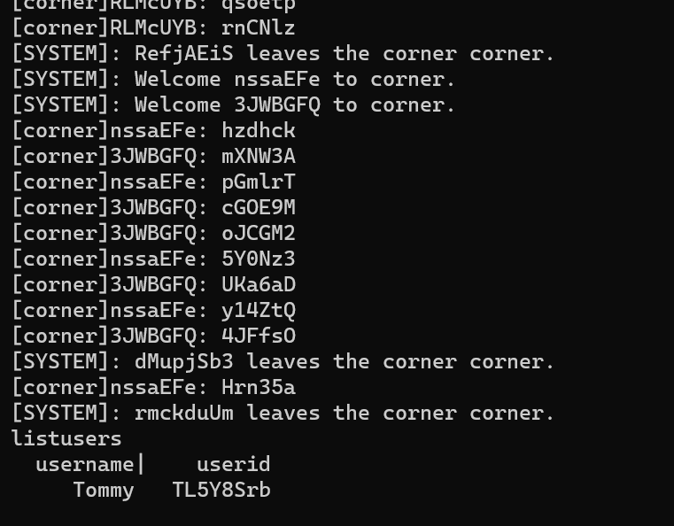
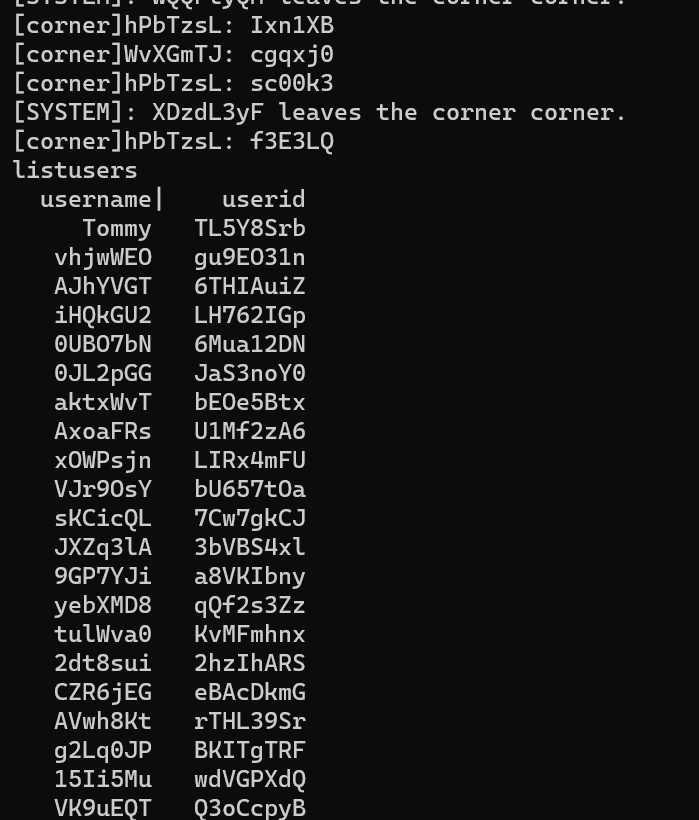

# 网上英语角PJ说明

## 运行

运行在Linux环境中

```
python ./Client.py
python ./Server.py
```

## 消息格式

**信息规划**

消息格式参照HTTP，分为消息头和消息体，两者之间用`\r\n\r\n`分隔

消息头由多个键值对组成，每个键值对之间由`\r\n`分隔，键和值之间用`: `分隔

无论是客户端发往服务器还是服务器返回数据给客户端，其大体的格式都是相同的

**客户端发往服务端**

头部需要包含两个字段，type、user，type表示请求类型，user表示用户ID

消息体内的信息格式由type决定，详细内容见“基本功能”

**服务端发往客户端**

头部需要包含三个字段：type、code、msg。type表示返回的回执种类；code表示状态码，此处只有200和400两种，200表示成功，400表示失败；msg表示说明文字。

消息体内的信息格式由type决定，详细内容见“基本功能”

## 基本功能

### 管理员

假设管理员的id为root

**可用的指令：**

```
opencorner cornerName cornerLanguage
corners
listusers
kickout userId
enter cornerName
exit cornerName
closecorner cornerName
leave
```

#### /opencorner

执行：`/opencorner cornerName`

开通新的外语角，包括名字、语种等基本信息

root开通名为myCorner的，语种为English的外语角，向服务器发送：

```json
{
    "header": {
        "type": "opencorner",
        "user": "root"
    },
    "body": "myCorner\tEnglish"
}
```

服务器返回：

```json
{
    "header": {
        "type": "opencorner",
        "code": "200",
        "msg": "open corner success"
    },
    "body": ""
}

{
    "header": {
        "type": "opencorner",
        "code": "400",
        "msg": "cornerName already exists"
    },
    "body": ""
}
```

#### /corners

执行：`/corners`

列出所有开通的外语角

向服务器发送：

```json
{
    "header": {
        "type": "corners",
        "user": "root"
    },
    "body": ""
}
```

假设存在两个外语角，服务器返回：

```json
{
    "header": {
        "type": "corners",
        "code": "200",
        "msg": "list all corners"
    },
    "body": "corner1\tlanguage1\ncorner2\tlanguage2"
}
```

#### /listusers

执行：`/listusers`

列出当前所在外语角的所有用户

向服务器发送：

```json
{
    "header": {
        "type": "listusers",
        "user": "root"
    },
    "body": ""
}
```

假设存在两个用户，服务器返回：

```json
{
    "header": {
        "type": "listusers",
        "code": "200",
        "msg": "list all users"
    },
    "body": "username1\tuserId1\nusername2\tuserId2"
}
{
    "header": {
        "type": "listusers",
        "code": "400",
        "msg": "You are not in any corner."
    },
    "body": ""
}
```

#### /kickout

执行：`/kickout userId`

将某个用户踢出当前外语角，并通知当前外语角的所有其他用户

假设要踢出user1向服务器发送：

```json
{
    "header": {
        "type": "kickout",
        "user": "root"
    },
    "body": "user1"
}
```

服务器返回：

```json
{
    "header": {
        "type": "kickout",
        "code": "200",
        "msg": "kickout user successfully"
    },
    "body": "user1"
}
{
    "header": {
        "type": "kickout",
        "code": "400",
        "msg": "No such user"
    },
    "body": "user1"
}
```

#### /enter

执行`/enter cornerName`

进入某个外语角，可以看到外语角所有用户发来的信息

假设要进入myCorner，向服务器发送：

```json
{
    "header": {
        "type": "enter",
        "user": "root"
    },
    "body": "myCorner"
}
```

服务器返回：

```json
{
    "header": {
        "type": "enter",
        "code": "200",
        "msg": "enter corner successfully"
    },
    "body": ""
}
{
    "header": {
        "type": "enter",
        "code": "400",
        "msg": "No such corner"
    },
    "body": ""
}
{
    "header": {
        "type": "enter",
        "code": "400",
        "msg": "You are already in a corner."
    },
    "body": ""
}
```

#### /exit

执行`/exit cornerName`

退出某个外语角，不再看到外语角所有用户发来的信息

假设要退出myCorner，向服务器发送：

```json
{
    "header": {
        "type": "exit",
        "user": "root"
    },
    "body": "myCorner"
}
```

服务器返回：

```json
{
    "header": {
        "type": "exit",
        "code": "200",
        "msg": "exit corner successfully"
    },
    "body": "myCorner"
}
{
    "header": {
        "type": "exit",
        "code": "400",
        "msg": "No such corner"
    },
    "body": "myCorner"
}
{
    "header": {
        "type": "exit",
        "code": "400",
        "msg": "You are not in that corner"
    },
    "body": "myCorner"
}
```

#### /closecorner

执行：`/closecorner cornerName`

关闭某个已开通的外语角，并向该外语角的所有用户发出通知

向服务器发送：

```json
{
    "header": {
        "type": "closecorner",
        "user": "root"
    },
    "body": "myCorner"
}
```

服务器返回：

```json
{
    "header": {
        "type": "closecorner",
        "code": "200",
        "msg": "close corner successfully"
    },
    "body": ""
}
{
    "header": {
        "type": "closecorner",
        "code": "400",
        "msg": "No such corner"
    },
    "body": ""
}
```

#### /leave

退出软件

向服务器发送：

```json
{
    "header": {
        "type": "leave",
        "user": "root"
    },
    "body": ""
}
```

服务器返回：

```json
{
    "header": {
        "type": "leave",
        "code": "200",
        "msg": "goodbye"
    },
    "body": ""
}
```

### 客户

假设客户的id为user1

**可用的指令：**

```
corners
listusers
join cornerName userName
quit cornerName
private userId content
msg cornerName content
leave
```

#### /corners

执行：`/corners`

列出所有开通的外语角

向服务器发送：

```json
{
    "header": {
        "type": "corners",
        "user": "user1"
    },
    "body": ""
}
```

假设存在两个外语角，服务器返回：

```json
{
    "header": {
        "type": "corners",
        "code": "200",
        "msg": "list all corners"
    },
    "body": "corner1\tlanguage1\ncorner2\tlanguage2"
}
```

#### /listusers

执行：`/listusers`

列出当前所在外语角的所有用户

向服务器发送：

```json
{
    "header": {
        "type": "listusers",
        "user": "user1"
    },
    "body": ""
}
```

假设存在两个用户，服务器返回：

```json
{
    "header": {
        "type": "listusers",
        "code": "200",
        "msg": "list all users"
    },
    "body": "username1\tuserId1\nusername2\tuserId2"
}
{
    "header": {
        "type": "listusers",
        "code": "400",
        "msg": "You are not in any corner."
    },
    "body": ""
}
```

#### /join

执行：`/join cornerName userName`

以用户名username加入corner的外语角

能够随时切换到其他外语角

加入后，用户发送的信息可以被其他用户收到

假设要进入myCorner，向服务器发送：

```json
{
    "header": {
        "type": "join",
        "user": "user1"
    },
    "body": "myCorner\tanonymous"
}
```

服务器返回：

```json
{
    "header": {
        "type": "join",
        "code": "200",
        "msg": "enter corner successfully"
    },
    "body": "myCorner\tanonymous"
}
{
    "header": {
        "type": "join",
        "code": "400",
        "msg": "No such corner"
    },
    "body": "myCorner\tanonymous"
}
{
    "header": {
        "type": "join",
        "code": "400",
        "msg": "username already exists."
    },
    "body": "myCorner\tanonymous"
}
```

#### /quit

执行`/quit cornerName`

退出某个外语角，不再看到外语角所有用户发来的信息

假设要退出myCorner，向服务器发送：

```json
{
    "header": {
        "type": "quit",
        "user": "user1"
    },
    "body": "myCorner"
}
```

服务器返回：

```json
{
    "header": {
        "type": "quit",
        "code": "200",
        "msg": "equit corner successfully"
    },
    "body": "myCorner"
}
{
    "header": {
        "type": "quit",
        "code": "400",
        "msg": "No such corner"
    },
    "body": "myCorner"
}
{
    "header": {
        "type": "quit",
        "code": "400",
        "msg": "You are not in that corner"
    },
    "body": "myCorner"
}
```

#### /private

执行：`/private userid msg`

给用户id为userid的用户发送一条私人信息

向服务器发送

```json
{
    "header": {
        "type": "private",
        "user": "user1"
    },
    "body": "userid\thello world"
}
```

服务器返回：

```json
{
    "header": {
        "type": "private",
        "code": "200",
        "msg": "send message successfully"
    },
    "body": ""
}
{
    "header": {
        "type": "private",
        "code": "400",
        "msg": "No such user"
    },
    "body": ""
}
```

服务器发给目标用户：
```json
{
    "header": {
        "type": "whisper",
        "code": "200",
        "msg": "message from user"
    },
    "body": "userid\thello world"
}
```

#### /msg

执行：`/msg cornerName msg`

在外语角corner发送一条消息

向服务器发送

```json
{
    "header": {
        "type": "msg",
        "user": "user1"
    },
    "body": "myCorner\thello everyone"
}
```

服务器返回：

```json
{
    "header": {
        "type": "msg",
        "code": "200",
        "msg": "send message successfully"
    },
    "body": ""
}
{
    "header": {
        "type": "msg",
        "code": "400",
        "msg": "No such corner"
    },
    "body": ""
}
{
    "header": {
        "type": "msg",
        "code": "400",
        "msg": "You are not in that corner"
    },
    "body": "myCorner\thello everyone"
}
```

服务器发给所有外语角的用户（如果是管理员，身份为id）：
```json
{
    "header": {
        "type": "chat",
        "code": "200",
        "msg": "message in corner"
    },
    "body": "userName\thello world"
}
```

#### /leave

退出软件

向服务器发送：

```json
{
    "header": {
        "type": "leave",
        "user": "user1"
    },
    "body": ""
}
```

服务器返回：

```json
{
    "header": {
        "type": "leave",
        "code": "200",
        "msg": "goodbye"
    },
    "body": ""
}
```

### 游客（未登录）

**可用的指令：**

```
login role
corners
leave
```

#### /login

执行：`/login mode`

向服务器发送：

```json
{
    "header": {
        "type": "login",
        "user": ""
    },
    "body": "root"
}
{
    "header": {
        "type": "login",
        "user": ""
    },
    "body": "client"
}
```

生成userId，服务器返回：

```json
{
    "header": {
        "type": "login",
        "code": "200",
        "msg": "login success"
    },
    "body": "client\t3ZHH21IS"
}
{
    "header": {
        "type": "login",
        "code": "400",
        "msg": "invalid mode"
    },
    "body": ""
}
```

#### /leave

退出软件

向服务器发送：

```json
{
    "header": {
        "type": "leave",
        "user": ""
    },
    "body": ""
}
```

服务器返回：

```json
{
    "header": {
        "type": "leave",
        "code": "200",
        "msg": "goodbye"
    },
    "body": ""
}
```

#### /corners

执行：`/corners`

列出所有开通的外语角

向服务器发送：

```json
{
    "header": {
        "type": "corners",
        "user": ""
    },
    "body": ""
}
```

假设存在两个外语角，服务器返回：

```json
{
    "header": {
        "type": "corners",
        "code": "200",
        "msg": "list all corners"
    },
    "body": "corner1\tlanguage1\ncorner2\tlanguage2"
}
```

## 创新点

- 管理员不需要在服务端工作，可以远端工作
- 业务逻辑不依赖于协议设计，即可以随时修改应用层协议，消息交换格式
- 封装Socket对象，可以随时更换使用的传输层协议，即TCP或UDP
- 释放资源：当用户无操作超过一定时间后，自动注销用户，防止连接中断导致的僵尸用户，提高服务器服务的最大人数

## 服务器负载测试

利用脚本（test目录下），可以处理10个用户在同一个聊天室发送信息，但100个用户同时在一个聊天室中发送消息会出现差错，主要问题在于丢包，可能是服务器处理不及时导致缓冲区满。

10个用户同时加入一个聊天室，并每人同时发送5条消息后离开：发现最终全部离开（Tommy为观察者）



100个用户涌入聊天室后发现，很多用户没有离开聊天室，这是leave命令出现丢包导致的，并且观察输出后发现，聊天内容也不足500条（100*5），为了解决这个问题，服务器设置了用户会话定时过期，减小这种退出未传达的损失。



改进方向：

缓冲区满一方面可以减小每个数据报文的长度，即让缓冲区容纳更多消息，但这只是权宜之计，最终仍需要改进服务器端的处理逻辑，在消息头部添加更多控制字段，帮助服务器快速做出应对。

比如目前我的消息中没有明确用户的角色（管理员还是用户），需要在服务器端作额外验证。

异常指令在服务器端做验证，比如不能在没有加入聊天室时发消息，这些也在服务器端检测，可以在客户端维护一定的用户信息，以分担服务器的工作量。
